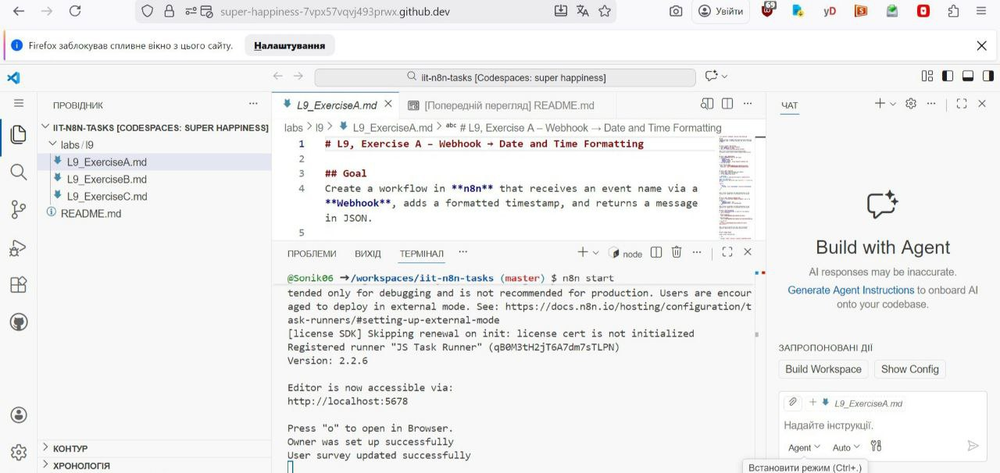
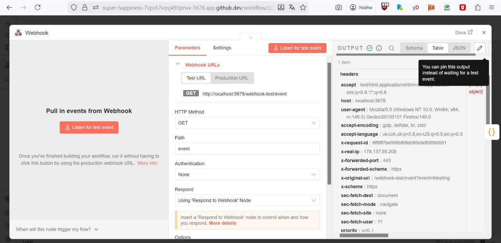
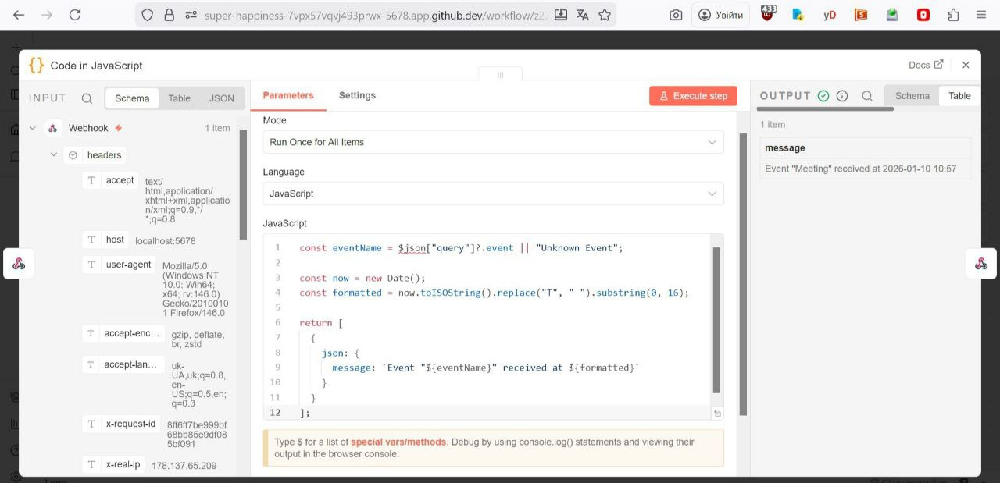
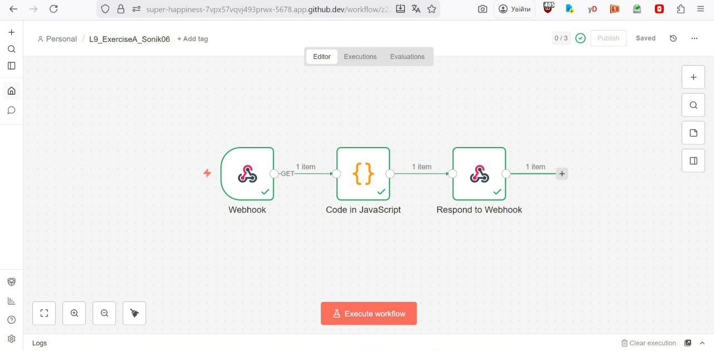
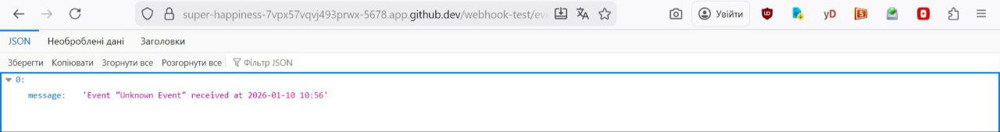
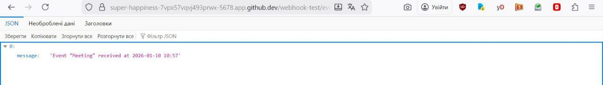

Firstly, I opened the repository in Codespace, installed n8n and started it:
 

After that I created a new workflow.
I added a Webhook Node:

Added a Code Node:

Respond to Webhook Node:

Then I executed and tested my Workflow:

Execution results:

