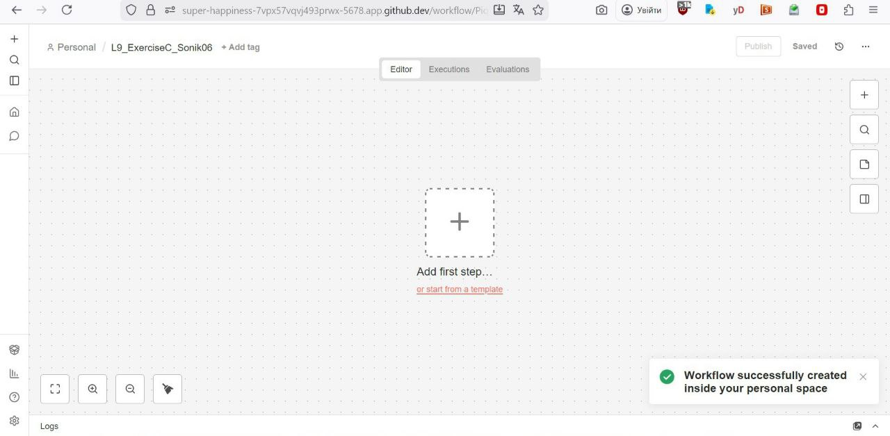
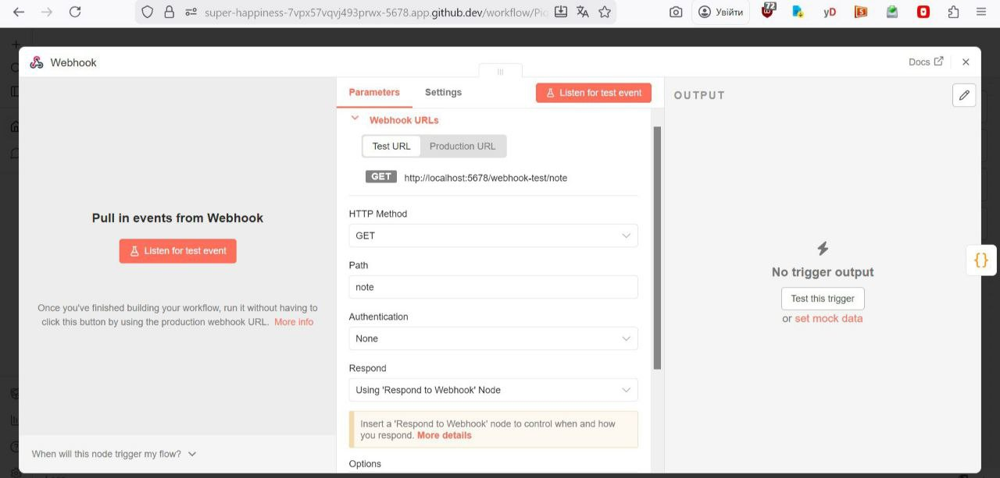
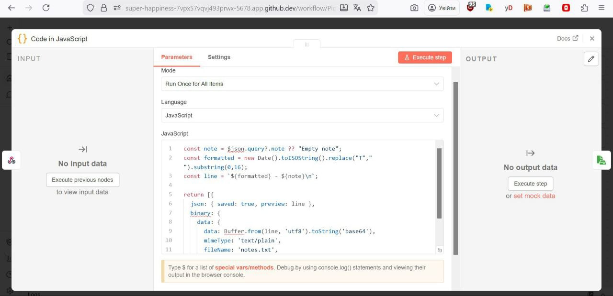
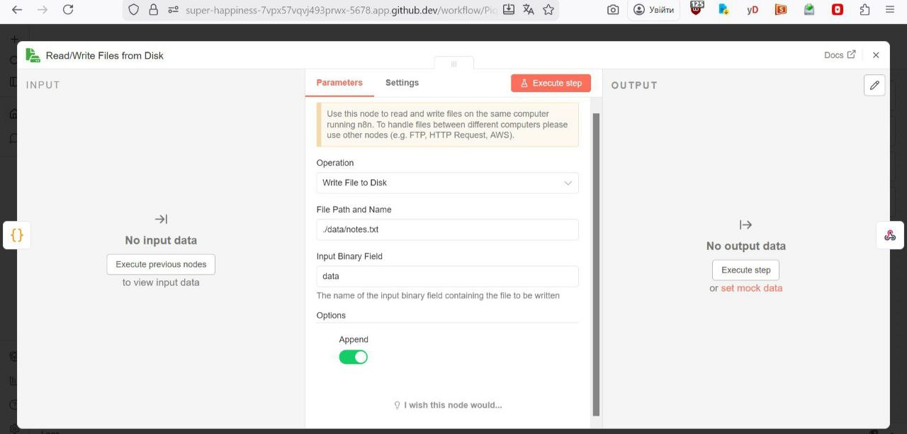
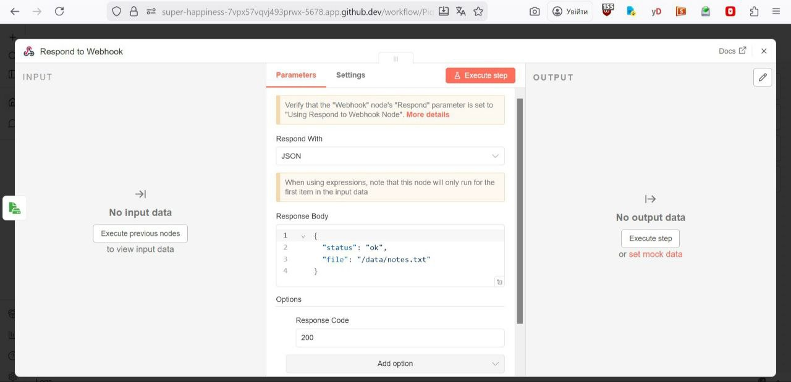
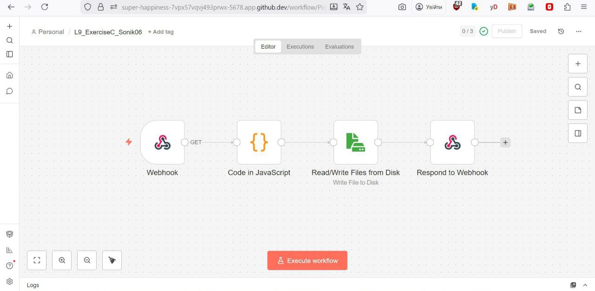
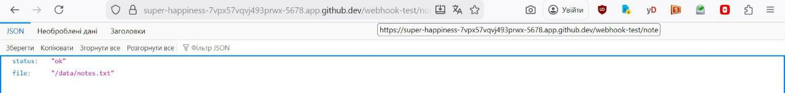
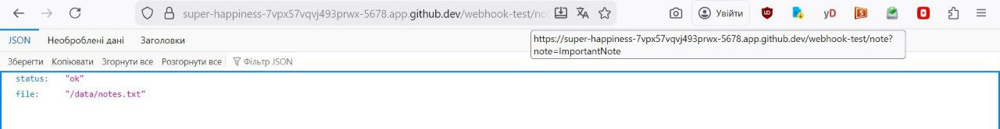
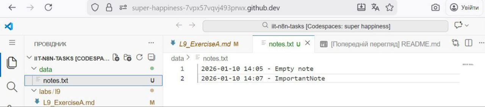

I created a new Workflow:

Added a Webhook Node:

Added a Code Node:

Added a Write Binary File Node:

Added a Respond to Webhook Node:

After that I saved and tested the workflow:

Execution results:

notes.txt file in my Codespace:

